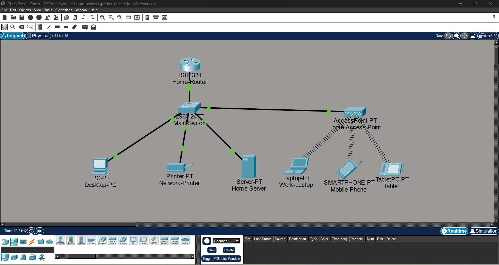

# Secure Virtual Home Network

## Project Overview

This project demonstrates the design and implementation of a virtual home network using Cisco Packet Tracer.

The objective of this project is to simulate a realistic home network environment while applying networking and cybersecurity concepts such as IP addressing, DHCP configuration, wireless networking, network segmentation, and security hardening.

The project is developed in multiple phases, starting with a functional network foundation before implementing cybersecurity improvements.

---

# Objectives

- Design a functional home network topology
- Configure routers, switches, and wireless devices
- Implement proper IP addressing and network communication
- Configure DHCP services for client devices
- Apply cybersecurity practices to improve network security
- Document network configurations, testing results, and security implementations

---

# Technologies Used

- Cisco Packet Tracer
- Cisco IOS Command Line Interface (CLI)
- IPv4 Networking
- DHCP
- VLAN Configuration
- SSH Remote Management
- Access Control Lists (ACL)
- Switch Port Security
- Git & GitHub

---

# Network Devices Used

| Device | Purpose |
|---|---|
| Cisco ISR 4331 Router | Routing and DHCP services |
| Cisco Catalyst 2960 Switch | LAN connectivity |
| Cisco AP-PT | Wireless network access |
| Desktop-PC | Wired client device |
| Work-Laptop | Wireless client device |
| Home Server | Internal network service |
| Network Printer | Network peripheral |
| Mobile Phone | Wireless client |
| Tablet | Wireless client |

---

# Network Topology



---

# Phase 1: Functional Home Network ✅

Completed implementation:

- Designed home network topology
- Configured Cisco ISR 4331 router
- Configured LAN connectivity through Catalyst 2960 switch
- Implemented DHCP services
- Assigned static IP addresses for server and printer
- Configured wireless connectivity using AP-PT
- Connected wired and wireless clients
- Performed connectivity testing

---

# IP Addressing Scheme

Network:

```
192.168.10.0/24
```

| Device | IP Address | Assignment |
|---|---|---|
| Router | 192.168.10.1 | Static |
| Home Server | 192.168.10.10 | Static |
| Network Printer | 192.168.10.20 | Static |
| Desktop-PC | 192.168.10.21 | DHCP |
| Work-Laptop | 192.168.10.24 | DHCP |
| Mobile Phone | 192.168.10.26 | DHCP |
| Tablet | 192.168.10.27 | DHCP |

---

# Wireless Configuration

Wireless network implemented using Cisco AP-PT.

SSID:

```
Fahmi-Home-Network
```

Security:

```
WPA2-PSK
```

Encryption:

```
AES
```

Connected wireless clients:

- Work-Laptop
- Mobile Phone
- Tablet

---

# Project Structure

```
virtual-home-network/

├── packet-tracer/
│   └── Cisco Packet Tracer project files
│
├── diagrams/
│   └── Network topology diagrams
│
├── configs/
│   └── Device configuration files
│
├── documentation/
│   └── Technical documentation
│
└── images/
    └── Screenshots and project visuals
```

---

# Documentation

Detailed project documentation:

- [Basic Network Setup](documentation/01-network-design.md)
- [IP Addressing](documentation/02-ip-addressing.md)
- [Wireless Configuration](documentation/03-wireless-configuration.md)
- [Testing Results](documentation/04-testing-results.md)

---

# Security Implementation

## Planned Security Enhancements

The following cybersecurity features will be implemented in future phases:

- VLAN-based network segmentation
- Guest WiFi isolation
- SSH secure device management
- Switch port security
- Access Control Lists (ACL)
- Network hardening techniques
- Firewall implementation
- IDS monitoring simulation

---

# Testing

Testing performed:

- Device connectivity testing
- IP address verification
- DHCP address assignment verification
- Wired network communication testing
- Wireless connectivity testing
- Configuration validation

---

# Future Improvements

Future enhancements may include:

- Firewall configuration
- Intrusion Detection System (IDS) simulation
- IoT device security
- VPN configuration
- Network monitoring and logging
- Security event analysis

---

# Author

Muhammad Fahmi

Cybersecurity Student  
Multimedia University (MMU)